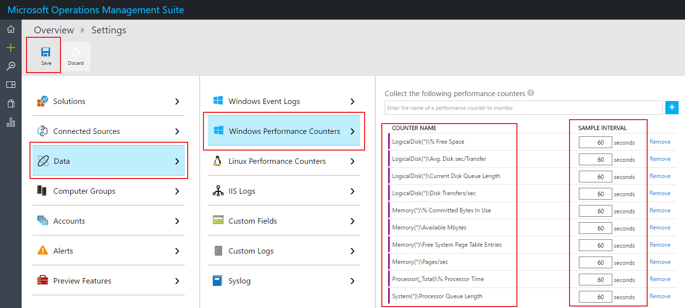
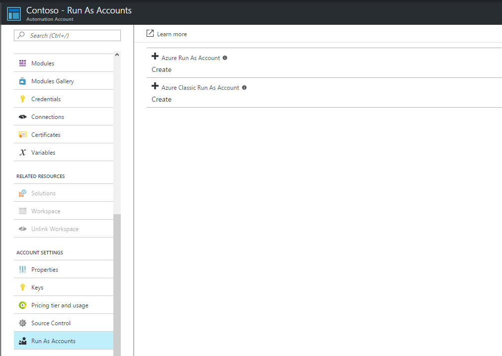
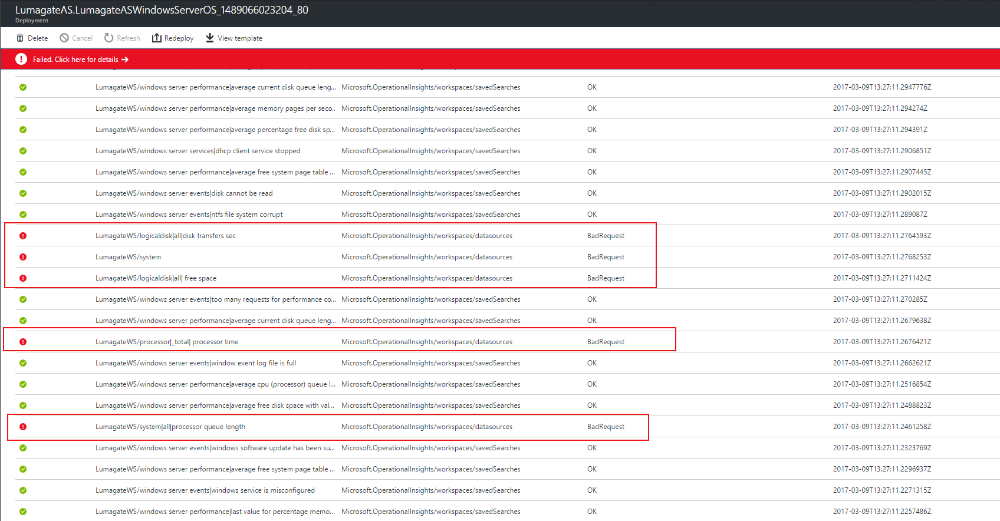
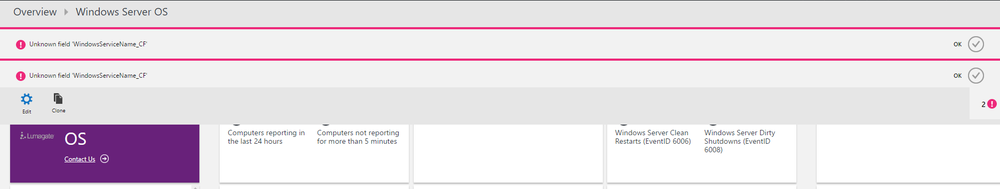

# Windows Server OS Solution Documentation
[Download Windows Server OS Solution (developed by Lumagate AS) documentation](Windows_Server_OS_Solution_Documentation.docx?raw=true).

## Known Deployment and Post-Deployment Issues

### Deployment fails when Performance data ingestion interval is changed from 10 to another value

The deployment fails with the following error:

```
Error submitting the deployment request. Additional details from the underlying API that might be helpful: Deployment template validation failed: 'The provided value for the template parameter 'performanceCountersIntervalinSeconds' at line '43' and column '46' is not valid.'. (Code: InvalidTemplate)
```

Please leave this value to 10 for now. If you want to change the interval, deploy with default value of 10 and change the interval after the deployment from OMS Portal.




### You do not have permissions to create an Azure Run As account (service principal) in Azure Active Directory.

The user account you are using to deploy the solution does not have sufficient permissions to create Run As account for Azure Automation. Please create in advance your Azure Automation account and create Run As account from Azure Portal with user that has sufficient permissions for this operation.



### Deployment fails with multiple Bad Requests in the deployed resources

You will get errors like in the picture below:



You've have one or more of the data sources below added to your Log Analytics Workspace via the Portal.

- Windows Event Logs
  - System
  - Application
- Windows Performance Counters
  - Memory(*)\Available MBytes
  - Memory(*)\Free System Page Table Entries
  - Memory(*)\Pages/sec
  - Processor(_Total)\% Processor Time
  - System(*)\Processor Queue Length
  - Memory(*)\% Committed Bytes In Use
  - LogicalDisk(*)\% Free Space
  - LogicalDisk(*)\Current Disk Queue Length
  - LogicalDisk(*)\Disk Transfers/sec
  - LogicalDisk(*)\Avg. Disk sec/Transfer

The documentation of the solution states that these should be removed from the OMS portal prior the deployment of the solution.


### Unknown field 'WindowsServiceName_CF' and/or 'WindowsServiceState_CF' error

When you open the solution view you may see the errors below:



As per the solution documentation additional manual configuration is required after the deployment. Check the documentation and execute the configuration steps.